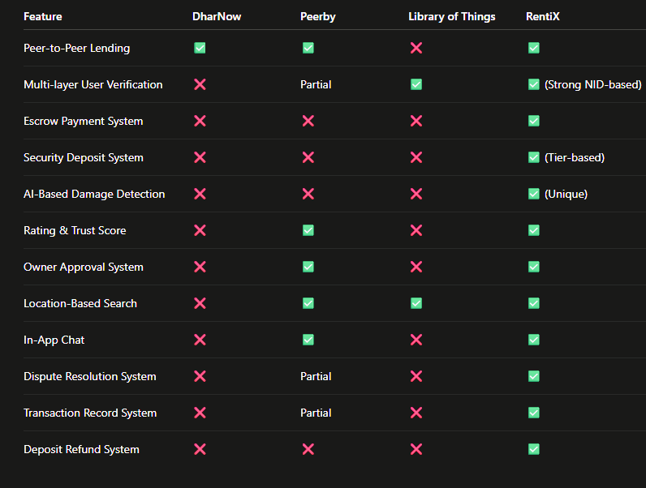

# 🚀 RentiX – Peer-to-Peer Rental Ecosystem

## 📌 Overview

RentiX is a web-based **peer-to-peer (P2P) rental platform** that allows users to **rent, lend, and share** everyday items such as tools, electronics, and appliances within a **trusted community**.

It helps users save money, earn from unused products, and promotes **efficient resource utilization** as well as **sustainability** by reducing the need to purchase rarely-used items.

The platform focuses on solving major challenges like **trust, security, and damage control**.

---

## 🎯 Motivation

Many people purchase items that are rarely used, leading to wasted money and resources. At the same time, others may need those items temporarily but cannot afford to buy them.

Existing platforms often lack:

* Strong trust systems
* Fraud prevention mechanisms
* Damage control solutions

RentiX aims to create a secure and reliable ecosystem for peer-to-peer sharing.

---

## 🎯 Features

### 🔍 Core Platform Features

* 🔍 **Browse Listings** – Find items available for rent nearby
* 📦 **List Your Items** – Upload and rent out your own products
* 💬 **User Communication** – Chat with owners/renters
* 📅 **Booking System** – Select rental duration easily
* 🔐 **Secure Authentication** – User login & registration system
* 💳 **Payment Integration** – Secure online payments

### 🔒 Security & Trust Features

* 🔒 **Multi-Layer User Verification**
  Users must verify identity using NID, phone number, address, and student/job ID.

* 💰 **Escrow-Based Smart Payment**
  Payments are held securely and released after successful return.

* 📊 **Tier-Based Security Deposit**

  * 0–5k BDT: 10% deposit
  * 6k–20k BDT: 50% deposit
  * 21k+ BDT: Full deposit

* 📸 **AI-Assisted Damage Detection**
  Image comparison before and after rental to detect damage.

* ⭐ **Rating & Trust Score System**
  Builds user credibility and trust.

* 🤝 **Owner Approval System**
  Owners can accept or reject requests.

* ⚖️ **Dispute Resolution System**
  Admin-based conflict resolution.

* 📍 **Location-Based Search**
  Find items near your location.

* 🧾 **Transaction Records**
  Full transparency of all activities.

---

## 📊 Benchmark Analysis

### 🔍 Competitors
- [DharNow](https://www.dharnow.com/)
- [Peerby](https://www.peerby.com/en-nl)
- [Library of Things](https://www.libraryofthings.co.uk/)

---
## 📊 Benchmark Analysis

### 🔍 Comparison Chart




### 🚀 RentiX Advantages

* 🔐 Strong identity verification
* 💰 Secure escrow-based payments
* 📊 Smart deposit system
* 📸 AI-assisted damage detection
* ⭐ Trust scoring system

---

## 🧠 Core Concept

**“Make borrowing cheap, but misuse risky and traceable.”**

---

## 🛠️ Tech Stack

### Frontend

* HTML, CSS, JavaScript
* React.js
* Tailwind CSS

### Backend

* Node.js / Python (Django / FastAPI)
* REST API

### Database

* PostgreSQL / MongoDB

### Authentication

* JWT + OTP verification

### Payment Integration

* bKash / Nagad / Stripe

### AI & Image Processing

* Python (OpenCV / TensorFlow)

### Deployment

* AWS / Vercel / Netlify
* Docker (optional)

---

## 📂 Project Structure

```
rentix/
│── frontend/
│── backend/
│── database/
│── assets/
│── README.md
```

---

## ⚙️ Installation & Setup

1. Clone the repository:

```
git clone https://github.com/your-username/rentix.git
```

2. Navigate to the project folder:

```
cd rentix
```

3. Install dependencies:

```
npm install
```

4. Run the project:

```
npm start
```

---

## 📦 Project Scope

### Current Scope

* Web-based platform
* Everyday item lending system
* Secure peer-to-peer transactions

### Future Scope

* Mobile app (Android/iOS)
* Advanced AI damage detection
* Smart recommendation system
* Improved search & filtering

---

## 👥 Team Members

* Your Name
* Your Friend's Name

---

## 📸 Preview

*(Add screenshots of your project UI here)*

---

## 🤝 Contribution

Contributions are welcome! Feel free to fork the repository and submit a pull request.

---

## 📄 License

This project is for academic and educational purposes.

---

## 📬 Contact

* Email: [your-email@example.com](mailto:your-email@example.com)
* GitHub: https://github.com/your-username

---

⭐ **If you like this project, don't forget to give it a star!**
🔗 [**Try the Live Project**]
